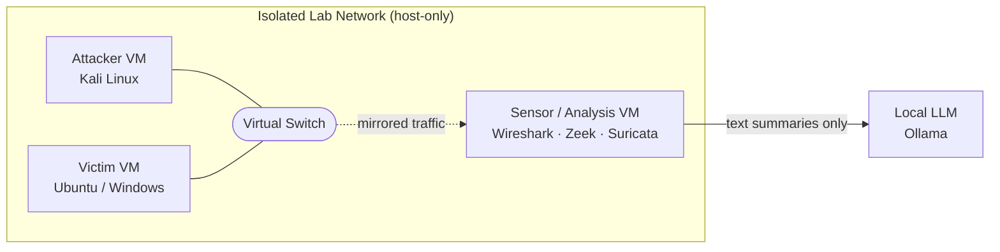

<div align="center">

# Network Traffic Analysis & C2/Exfiltration Detection for SOC

**A hands-on, evidence-driven network threat detection project: from packet-level fundamentals to detection engineering and AI-assisted triage.**


</div>

---

## Table of Contents

1. [Project Overview](#section-1)
2. [Objectives](#section-2)
3. [Scenario](#section-3)
4. [Lab Architecture](#section-4)
5. [Toolchain](#section-5)
6. [Repository Structure](#section-6)
7. [Methodology and Weekly Breakdown](#section-7)
8. [MITRE ATT&CK Coverage](#section-8)
9. [Detection Engineering](#section-9)
10. [AI-Assisted Triage](#section-10)
11. [Final Report Structure](#section-11)
12. [Evidence Handling and Ethics](#section-12)
13. [Project Status](#section-13)
14. [Skills Demonstrated](#section-14)
15. [References](#section-15)
16. [Author](#section-16)

---

<a id="section-1"></a>

## 1. Project Overview

Every intrusion has to talk to the network. Even when malware is obfuscated and endpoints are quiet, the attacker's **reconnaissance**, **command-and-control (C2)** channel, and **data exfiltration** leave measurable traces in network traffic.

This project simulates the workflow of a SOC analyst investigating a suspected compromise using network evidence only. It covers the full lifecycle:

> **Capture → Baseline → Analyze → Detect → Map to ATT&CK → Engineer Detections → Triage with AI → Report**

The output is a reproducible investigation package: annotated packet captures, Zeek/Suricata log reviews, an IOC list, custom detection logic and scripts, an ATT&CK mapping, and a SOC-style final report with an executive summary.

<a id="section-2"></a>

## 2. Objectives

| # | Objective | Outcome |
|---|-----------|---------|
| 1 | Build a solid network and protocol foundation | Protocol map, filter cheat sheet, traffic baseline |
| 2 | Identify anomalies against a known baseline | Documented findings, alert review, IOC list |
| 3 | Detect recon, C2 and exfiltration behaviors | Scan report, C2/exfil analysis, ATT&CK mapping |
| 4 | Convert analysis into reusable detections | Python detectors and Suricata rules |
| 5 | Use a local LLM responsibly for triage | Prompt library and human-validated findings |
| 6 | Communicate results to technical and executive audiences | Final report and executive summary |

<a id="section-3"></a>

## 3. Scenario

> A small organization suspects that a workstation on its internal network has been compromised. The SOC receives network captures and sensor logs. The analyst must determine **what happened, how it happened, what data left the network, and what to do next**, using network telemetry only.

The investigation follows the attacker's path: **Reconnaissance → Discovery → Command & Control → Exfiltration**.

Evidence comes from two sources:
- **Self-generated lab traffic** (attacker and victim VMs) to establish ground truth.
- **Public malware traffic captures** to practice on realistic, in-the-wild behavior.

<a id="section-4"></a>

## 4. Lab Architecture



**Design notes**
- The lab is **isolated** (host-only network). No attack traffic touches production or the internet.
- The sensor VM observes mirrored traffic so analysis does not alter the evidence.
- The LLM runs **locally** and only receives sanitized text summaries, never raw PCAPs or sensitive data.

<a id="section-5"></a>

## 5. Toolchain

| Category | Tool | Purpose |
|----------|------|---------|
| Packet analysis | Wireshark, tshark | Interactive and scripted packet inspection |
| Network metadata | Zeek | Structured logs (`conn`, `dns`, `http`, `ssl`, `files`, `weird`, `notice`) |
| IDS | Suricata | Signature-based alerting and custom rules |
| Offensive simulation | Nmap, Python beacon scripts, DNS tunneling tools | Generating labeled attack traffic |
| Scripting | Python 3, jq, zeek-cut | Detection scripts and log processing |
| AI | Ollama (local LLM) | Summarization, IOC drafting, report assistance |
| Framework | MITRE ATT&CK, ATT&CK Navigator | Behavior classification and coverage visualization |
| Documentation | Markdown, draw.io | Reports, diagrams, cheat sheets |

<a id="section-6"></a>

## 6. Repository Structure

```
network-threat-detection-soc/
│
├── README.md
├── evidence-log.md                  # Chain of custody: PCAP name, SHA-256, source, date
│
├── week1-foundations/
│   ├── protocol-map/                # OSI/TCP-IP & protocol reference (diagram + table)
│   ├── pcaps/                       # Baseline captures (browsing, DNS, handshake, file transfer)
│   ├── filter-cheatsheet.md         # Wireshark capture & display filter reference
│   └── baseline-summary.md          # Normal traffic profile used for comparison
│
├── week2-analysis/
│   ├── zeek-logs/                   # Generated Zeek logs
│   ├── suricata-output/             # eve.json / fast.log
│   ├── alert-review.md              # True/False positive triage with justification
│   ├── findings.md                  # Structured findings (ID, severity, evidence)
│   ├── ioc-list.csv                 # type, value, context, first_seen, source_pcap, confidence
│   └── evidence/                    # Trimmed PCAPs containing only suspicious packets
│
├── week3-detection/
│   ├── scan-detection.md            # Nmap scan signatures and detection
│   ├── c2-exfil-analysis.md         # Beaconing, DGA, exfiltration, web shell analysis
│   ├── mitre-mapping.md             # Technique ↔ evidence ↔ detection table
│   ├── attack-navigator-layer.json  # ATT&CK Navigator coverage layer
│   ├── detection-logic.md           # Conditions, thresholds, expected false positives
│   ├── scripts/
│   │   ├── beacon_detect.py         # Interval-regularity beacon detector
│   │   └── dga_entropy.py           # Domain entropy scoring
│   └── rules/
│       └── custom.rules             # Custom Suricata rules
│
├── week4-ai-triage/
│   ├── prompt-library.md            # Reusable, categorized prompts
│   └── validation-table.md          # AI claim → verification → verdict
│
└── final-report/
    ├── Final-Network-Threat-Detection-Report.pdf
    └── Executive-Summary.pdf
```

<a id="section-7"></a>

## 7. Methodology and Weekly Breakdown

### Week 1: Network Foundations & Traffic Capture
**Goal:** Learn what *normal* looks like. Anomalies are meaningless without a baseline.

- Review OSI/TCP-IP, IP addressing, subnetting, and core protocols (HTTP, DNS, SMTP, SMB, SSH, RDP).
- Configure Wireshark; practice **capture filters (BPF)** vs **display filters**.
- Capture four traffic types: web browsing, DNS, TCP handshake, file transfer.
- Annotate captures with packet comments and screenshots.
- Build a quantitative baseline (protocol hierarchy, top talkers, packet sizes, I/O rate).

| Deliverable | Location |
|---|---|
| Network protocol map | `week1-foundations/protocol-map/` |
| Wireshark filter cheat sheet | `week1-foundations/filter-cheatsheet.md` |
| Annotated PCAPs | `week1-foundations/pcaps/` |
| Baseline traffic summary | `week1-foundations/baseline-summary.md` |

### Week 2: Protocol Analysis & Anomaly Identification
**Goal:** Separate suspicious from normal using protocol-level evidence.

- Analyze HTTP, DNS, SMB, TLS metadata (SNI, certificates, JA3), and TCP streams.
- Hunt for unusual ports, periodic beaconing, unexpected destinations, DNS tunneling, and large outbound transfers.
- Process captures with **Zeek** (context-rich logs) and **Suricata** (signature alerts).
- Triage every alert as True Positive or False Positive with written justification.
- Extract IOCs and preserve minimal, trimmed PCAP evidence.

| Deliverable | Location |
|---|---|
| Protocol analysis & suspicious findings | `week2-analysis/findings.md` |
| Zeek / Suricata alert review | `week2-analysis/alert-review.md` |
| IOC list | `week2-analysis/ioc-list.csv` |
| PCAP evidence | `week2-analysis/evidence/` |

### Week 3: Recon, C2 & Exfiltration Detection
**Goal:** Detect the attacker's kill-chain stages and turn analysis into detection logic.

- Identify **Nmap** scanning (SYN, NULL, XMAS), OS fingerprinting, and service enumeration.
- Analyze malicious PCAPs for **C2 beaconing**, **DGA**, **data exfiltration**, and **web shell** traffic.
- Map every finding to MITRE ATT&CK with packet-level evidence.
- Build detection scripts and Suricata rules; document thresholds and expected false positives.

| Deliverable | Location |
|---|---|
| Scan detection report | `week3-detection/scan-detection.md` |
| C2 / exfiltration analysis | `week3-detection/c2-exfil-analysis.md` |
| MITRE ATT&CK mapping | `week3-detection/mitre-mapping.md` |
| Detection logic, scripts, rules | `week3-detection/detection-logic.md`, `scripts/`, `rules/` |

### Week 4: AI-Assisted Network Triage & Reporting
**Goal:** Use AI to accelerate analysis, while keeping a human accountable for every conclusion.

- Run a **local LLM** via Ollama on sanitized text summaries (tshark/Zeek output).
- Build a reusable prompt library for triage, IOC extraction, and report drafting.
- **Validate every AI claim manually** against the PCAP and record the verdict.
- Produce the final SOC-style report and executive summary.

| Deliverable | Location |
|---|---|
| AI prompt library | `week4-ai-triage/prompt-library.md` |
| Human-validated findings | `week4-ai-triage/validation-table.md` |
| Final report + executive summary | `final-report/` |

<a id="section-8"></a>

## 8. MITRE ATT&CK Coverage

Each technique is backed by evidence (PCAP + packet reference) in `week3-detection/mitre-mapping.md`.

| Tactic | Technique | ID | Observed Behavior |
|---|---|---|---|
| Reconnaissance | Active Scanning | T1595 | Nmap SYN/NULL/XMAS scans |
| Discovery | Network Service Discovery | T1046 | Port and service enumeration |
| Command and Control | Application Layer Protocol: Web Protocols | T1071.001 | HTTP/S beaconing |
| Command and Control | Application Layer Protocol: DNS | T1071.004 | DNS-based C2 / tunneling |
| Command and Control | Dynamic Resolution: DGA | T1568.002 | High-entropy domains, NXDOMAIN bursts |
| Exfiltration | Exfiltration Over C2 Channel | T1041 | Large outbound transfers over C2 |
| Exfiltration | Exfiltration Over Alternative Protocol | T1048 | Data staged through DNS / other protocols |
| Persistence | Server Software Component: Web Shell | T1505.003 | Command execution over HTTP requests |

> A coverage heatmap is available as an ATT&CK Navigator layer: `week3-detection/attack-navigator-layer.json`.

<a id="section-9"></a>

## 9. Detection Engineering

| Behavior | Approach | Artifact |
|---|---|---|
| **Beaconing** | Group connections by (src, dst), compute the coefficient of variation of inter-arrival times; low variance flags automated callbacks (jitter-aware) | `scripts/beacon_detect.py` |
| **DGA** | Shannon entropy and NXDOMAIN rate per host | `scripts/dga_entropy.py` |
| **Port scanning** | Single source contacting many ports with SYN-only/RST responses | `rules/custom.rules`, `scan-detection.md` |
| **DNS tunneling** | Abnormally long/high-frequency queries to a single domain | `rules/custom.rules` |
| **Exfiltration** | Outbound byte volume per destination versus baseline | `detection-logic.md` |

Every detection documents its **condition, threshold, data source, and expected false positives**, so it can be tuned in a real environment.

<a id="section-10"></a>

## 10. AI-Assisted Triage

**Principles**
1. **Local only:** the LLM runs on-prem via Ollama; no investigation data leaves the lab.
2. **Summaries, not raw captures:** the model receives sanitized text derived from tshark/Zeek.
3. **Human in the loop:** AI output is a *hypothesis*, never a finding, until verified against evidence.
4. **Everything is logged:** each AI claim is recorded with its verification method and verdict.

**Validation table format**

| AI Claim | Verification Method | Verdict (Correct / Incorrect / Partial) | Notes |
|---|---|---|---|

Documented hallucinations and misclassifications are included deliberately, to show where AI assistance helps and where it fails.

<a id="section-11"></a>

## 11. Final Report Structure

1. Cover page and document control
2. **Executive Summary** (one page, non-technical)
3. Scope and methodology
4. Environment and tooling
5. Incident timeline
6. Detailed findings (severity, confidence, evidence)
7. MITRE ATT&CK mapping
8. IOC table
9. Detection engineering (rules, scripts, logic)
10. AI-assisted triage and validation
11. Recommendations (immediate / short-term / long-term)
12. Limitations and lessons learned
13. Appendices

<a id="section-12"></a>

## 12. Evidence Handling and Ethics

- All offensive activity was performed in an **isolated lab** that I own and control.
- PCAPs are **hashed (SHA-256)** and tracked in `evidence-log.md`.
- Public malware captures are credited to their original sources; **live malware samples are not distributed** in this repository.
- Captures are **sanitized** of any personal or sensitive data before publication.
- This repository is for **defensive and educational purposes only**.

<a id="section-13"></a>

## 13. Project Status

- [ ] **Week 1:** Foundations & capture
- [x] **Week 2:** Protocol analysis & anomaly identification
- [ ] **Week 3:** Recon, C2 & exfiltration detection
- [ ] **Week 4:** AI-assisted triage & final report

<a id="section-14"></a>

## 14. Skills Demonstrated

- Network protocol analysis and packet forensics (Wireshark, tshark)
- Network security monitoring with Zeek and Suricata
- Threat hunting for beaconing, DGA, DNS tunneling, and exfiltration
- Detection engineering (custom rules, Python detectors, tuned thresholds)
- MITRE ATT&CK mapping backed by evidence
- IOC extraction and evidence handling
- Responsible, validated use of local LLMs in security workflows
- SOC-grade technical and executive reporting

<a id="section-15"></a>

## 15. References

- [MITRE ATT&CK](https://attack.mitre.org/)
- [Wireshark Documentation](https://www.wireshark.org/docs/)
- [Zeek Documentation](https://docs.zeek.org/)
- [Suricata Documentation](https://docs.suricata.io/)
- [Malware-Traffic-Analysis.net](https://www.malware-traffic-analysis.net/)
- [Ollama](https://ollama.com/)

<a id="section-16"></a>

## 16. Author

**Teamxdepi**

---

<div align="center">

*Built for learning, documented for reuse. Feedback and suggestions are welcome via issues or pull requests.*

</div>
